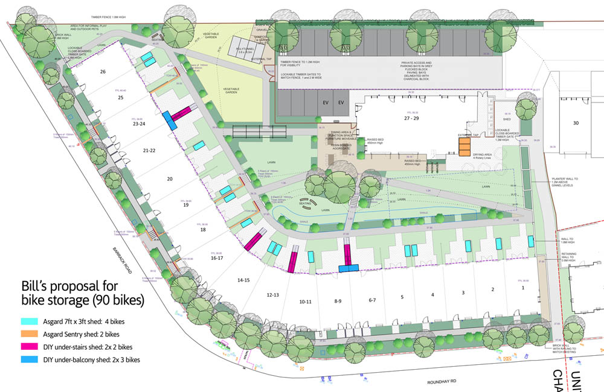
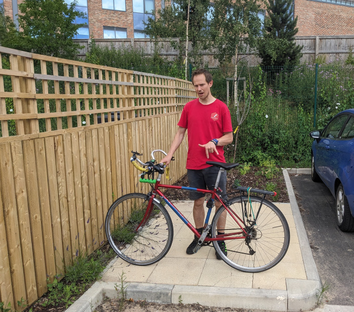

# bikeParking

Currently ChaCo’s cycle parking facilities look a bit like this:

Source (requires log-in):
https://www.chapeltowncohousing.org.uk/cycle-parking/

As of August 2023 we still don’t have sheffield stands. This is where
we’re looking to put them:

And 2 other spaces between car parking spaces.

# Quotes

We can get quotes from

- https://cyclehoop.com/product/sheffield-stand/ (tried, not open
  Saturdays)

- https://www.falco.co.uk/ (based in Leek)

- https://www.proctercontracts.co.uk/wp-content/uploads/2018/08/Sheffield-Cycle-Stand-Datasheet.pdf
  (Sales office in Leeds)

- https://www.cyclepods.co.uk/fully-welded-toast-rack/
